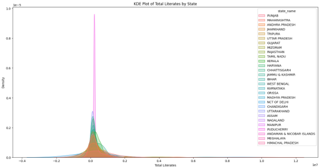
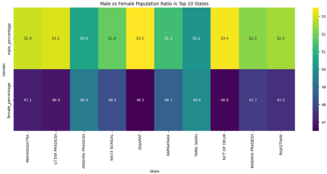
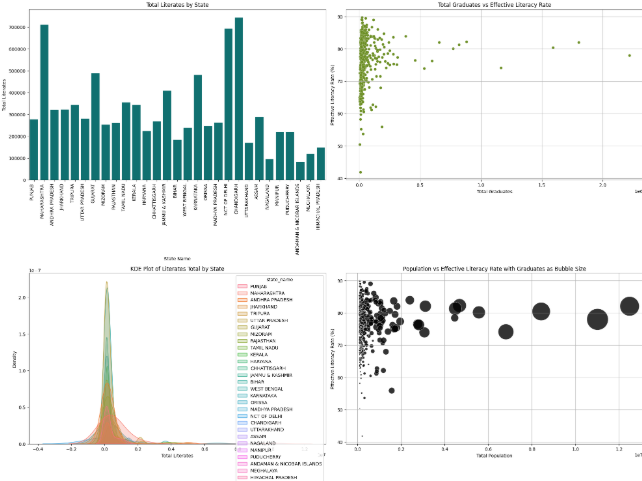

---

# 🏙️ India's Urban Pulse: A Deep Dive into City Demographics & Literacy 📊

Welcome to **India's Urban Pulse**! This project moves beyond simple spreadsheets to paint a vivid picture of the demographic and educational landscape of 493 Indian cities. By transforming raw data into compelling visualizations, we uncover patterns in population, literacy, and gender balance that tell the story of urban India.

---

### ✨ Visual Highlights

This analysis is driven by a series of custom visualizations designed to make the data clear, insightful, and easy to understand.

| Plot Type | Description | What It Reveals |
| :--- | :--- | :--- |
| **📊 Bar Chart** | **State of Literacy**: A clear, comparative bar chart showing the total number of literate individuals by state. | Instantly identifies the educational powerhouses and regions with opportunities for growth. |
| **Scatter Plot** | **Education & Literacy Link**: Explores the crucial relationship between the number of graduates and the overall effective literacy rate. | Confirms the positive correlation between higher education and broader literacy in urban centers. |
| **🌊 KDE Plot** | **Literacy Distribution**: A Kernel Density Estimate plot that reveals the *spread* and concentration of literacy levels within each state. | Goes beyond simple averages to show the true distribution of literacy across different populations. |
| **⚫ Bubble Plot** | **The Big Picture**: A multi-dimensional plot combining population, literacy rate, and graduate numbers into one powerful graphic. | Offers a holistic view, where bubble size indicates the scale of the graduate population in each city. |
| **Heatmap** | **Gender Balance Snapshot**: A color-coded heatmap of the top 10 most populous states, displaying the male vs. female population ratios. | Provides an at-a-glance understanding of gender demographics in major urban hubs. |
| **Grid Dashboard** | **All-in-One View**: A comprehensive 2x2 grid that brings all the key visualizations together for a complete analytical dashboard. | A full narrative of the dataset in a single, easy-to-digest format. |

---

### 🖼️ Visual Showcase

Here are the key visualizations generated from the analysis.

#### **KDE Plot of Total Literates by State**
*Understanding the distribution and density of literacy within each state.*

#### **Gender Ratios in Top 10 Most Populous States**
*A heatmap that quickly reveals the gender balance in major urban states.*

#### **Consolidated Dashboard**
*The multi-plot grid provides a complete overview of the key findings.*
`

---

### 📈 Key Insights at a Glance

*   **Literacy Leaders**: The analysis pinpoints states with the highest overall literacy counts and graduate populations, highlighting regional educational strengths.
*   **Positive Correlations**: A clear positive relationship is visualized between the number of graduates in a city and its effective literacy rate.
*   **Gender Ratio Variations**: The heatmap reveals significant variations in gender balance across India's most populous states, providing a basis for further socio-economic investigation.

---

### 💡 Future Scope: Making it Interactive!

While this notebook provides a deep static analysis, the true power of this data can be unlocked with interactivity!

*   **Interactive Dashboards**: Imagine these charts rebuilt with **Plotly** or **Bokeh**, allowing you to:
    *   Hover over data points for detailed tooltips.
    *   Zoom into specific regions on the plots.
    *   Filter the data dynamically by state or population size.
*   **Web Application**: The entire project could be deployed as a **Streamlit** or **Dash** web app. This would create a user-friendly, interactive dashboard for anyone to explore the data without needing to see or run a single line of code.

---

### 🛠️ Tech Stack

*   **Data Manipulation**: `Python`, `Pandas`, `NumPy`
*   **Data Visualization**: `Matplotlib`, `Seaborn`
*   **Environment**: `Google Colab / Jupyter Notebook`

---

### ▶️ How to Run This Project

1.  **Clone the Repository**: Get a local copy of the project files.
2.  **Set Up Environment**: Ensure you have Python and the libraries listed in the Tech Stack installed.
3.  **Load Data**: Place the `cities_r2.csv` dataset in the project's root directory.
4.  **Launch the Notebook**: Open and run the `population.ipynb` notebook to see the analysis unfold.

---

## 📌 Author

Developed by **Barna Das**  
🔗 [GitHub](https://github.com/barna-d)

---
